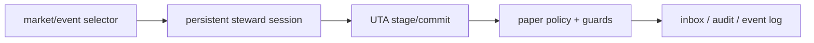
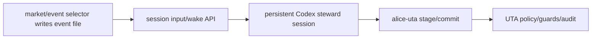

# Steward 生产式运行方式：当前事实与下一方向

> 版本：v0.4（2026-07-07）——跑通最小 live Codex steward smoke：`steward` workspace → Codex 常驻 session → event file → wake API → `STEWARD_WAKE_ACK`；同时修正 PTY 提交键必须写 CR(`\r`) 而不是裸 LF(`\n`)。
> 版本：v0.3（2026-07-07）——新增内置 `steward` workspace 模板，沉淀常驻 session 的行为协议：wake 后快速 ACK、读事件文件、有限决策循环、经 `alice-uta`/UTA policy/guards 执行、记录 decision/journal。
> 版本：v0.2（2026-07-07）——落地常驻 session 的最小控制边：可向 live PTY 注入事件 envelope，并提供 idle/no-output 条件唤醒；记录 maintainer 裁决：当前要模拟的是生产环境里的真实交易行为，不是离线 prompt 实验；交易点不应每次新开 `codex exec`，应转向 market/event selector 驱动的常驻 steward session。
> 地位：**运行方式决策文档**。从属于 [steward-plan.zh.md](steward-plan.zh.md) 的不变量，修正 P4/P3 战役里把 headless per-fire 当成生产路径的旧假设。
> 关联：[steward-agent-working-modes.zh.md](steward-agent-working-modes.zh.md)、[steward-p3-campaign.zh.md](steward-p3-campaign.zh.md)、[ANATOMY.md](../ANATOMY.md)。

## 1. Maintainer 裁决

当前目标不是继续做「实验」意义上的 prompt 测试，而是尽可能真实地模拟生产环境：agent 在真实账户状态、真实行情推进、真实 UTA policy/guards 下做交易决策。paper/mock 仍是资金安全边界，但行为形态要接近未来生产。

已确认的方向：

1. **Codex 可以是常驻工作进程**。不应把每个交易点都实现为一次新的 `codex exec`。
2. **暂不优先做 sub-agent / mechanical executor 编排**。可以先接受 token 多花一点，把精力放在生产式运行形态，而不是过早拆分执行器。
3. **正确主链路**：

## 2. 当前 OpenAlice 里 Codex 的两种形态

| 形态 | 代码路径 | 生命周期 | 当前用途 | 对交易生产模拟的判断 |
|---|---|---|---|---|
| Interactive PTY session | `SessionPool` + Codex adapter `composeCommand` | 可常驻，可 resume by id / last | 人类进入 workspace 与 agent 协作 | **应成为生产式 steward 的承载形态** |
| Headless one-shot | `POST /api/workspaces/:id/headless` → `codex exec --json -- <prompt>` | 每次 spawn 一个新进程，退出即完成 | 自动任务、观察报告、一次性 run | 不应作为每个交易点的生产交易决策路径 |

代码事实：

- Codex interactive adapter 支持 `resume --last` 和 `resume <id>`，见 `src/workspaces/adapters/codex.ts`。
- Headless route 的注释明确写着 fresh one-shot、not pooled，见 `src/webui/routes/workspaces.ts`。
- Headless runner 直接 `child_process.spawn` 后等待进程退出，见 `src/workspaces/headless-task.ts`。
- ScheduleScanner 当前只知道「到期 issue → headless dispatch」，见 `src/workspaces/schedule/scanner.ts`。

## 3. 为什么之前会慢

之前的 campaign harness 每个模拟周都调用一次 headless Codex。一次交易决策包含：启动 CLI、读完整 prompt、分析 tape、调用 `alice-uta` CLI、stage/commit、等待退出。真实观测中单次决策可到 60-230 秒，最长被 260 秒 watchdog 截断。

这说明的不是「Codex 不能做交易」，而是「每个交易点重开 headless Codex」这个形态不适合生产式交易模拟。它更像一次性任务执行器，而不是常驻 steward。

## 4. 交易点现在是谁决定的

现状分两层：

| 场景 | 交易点来源 |
|---|---|
| 正常 OpenAlice 自动任务 | workspace `.alice/issues/*.md` 里的 `when`，由 ScheduleScanner 每约 60 秒扫描，due 后触发 headless run |
| 当前 campaign harness | harness 人工定义：每个历史窗口 6 周，每 5 根日线触发一次决策 |

因此当前还没有生产级 `market/event selector`。未来应明确把「什么时候让 steward 看一眼」独立成一个产品部件：可以先是低频定时 + 事件过滤，后续再引入价格/波动/风险/持仓变化触发。

## 5. 已落地的常驻 session 控制边

2026-07-07 已补上第一刀：workspace live PTY 现在有一条服务端可调用的 stdin 注入边，用来把 selector/watchdog 的短 envelope 送进同一个 Codex/Claude session，而不是退回 headless。

代码入口：

- `PersistentSession.writeInput`：向 live PTY 写入 bytes/string，并记录 `lastInputAt`；同时 `lastOutputAt`/`lastActivityAt` 用于判断 session 是否长期无输出或无活动。
- `SessionPool.writeInput`：按 session record id 路由到 live PTY。
- `POST /api/workspaces/:id/sessions/:sid/input`：通用输入注入。默认自动追加终端 Enter（PTY CR，`\r`，不是裸 `\n`；裸 LF 会被 Codex TUI 当成 composer 换行而不提交）；若浏览器/其它 controller 正在持有 session，除非 `takeover:true`，否则返回 `session_locked`。
- `POST /api/workspaces/:id/sessions/:sid/wake`：标准 steward wake envelope。支持 `ifIdleForMs` 与 `ifNoOutputForMs`，因此外部 watchdog 可以幂等轮询：session 仍活跃则 skip，长期无输出才真正唤醒。

这不是交易 selector 本身；它是 selector 和 watchdog 未来要调用的安全边。预期生产式流程变为：

关键行为约束：

1. wake 只叫醒，不绕过 UTA；真正交易仍必须走 `alice-uta` 与 UTA guards。
2. 长期无输出或疑似卡住时，优先向原 session 发 wake；如果 session 已不 live，调用方应先 resume 再 wake。
3. 不对人类正在控制的 terminal 静默打字；controller lease 是默认保护。

## 6. 常驻 steward 的行为协议

2026-07-07 第二刀落在**agent 行为本身**：新增内置 workspace 模板
`src/workspaces/templates/steward/`。它不是新的交易执行器；它是一个
把当前生产式共识写进 CLAUDE.md / AGENTS.md 的 agent 承载环境。

模板创建时会准备三个 durable 根：

| 路径 | 用途 |
|---|---|
| `.alice/steward/events/` | selector/watchdog 写入的事件文件。wake envelope 只负责指向它；文件才是事实源。 |
| `decisions/` | material trade / no-trade / blocked decision 的审计记录。 |
| `journal/` | routine wake、心跳、低重要度观察记录。 |

模板指令要求 steward 在收到 `[OpenAlice steward wake]` 后：

1. 先输出 `STEWARD_WAKE_ACK <reason>`，让 watchdog 知道 live session 没死。
2. 读取 wake 指定的 event file；若未指定，则检查 `.alice/steward/events/` 的近期事件。
3. 做有边界的决策循环：账户状态、pending UTA git、持仓/订单、market clock、相关 quote/bar/news。
4. 只产生三类结果：`no_trade` / `propose_trade` / `blocked`。
5. 交易动作必须通过 `alice-uta`，并经过 UTA paper policy / guards / audit；不得绕过 UTA 或改用 broker 原生 API。
6. 记录 decision/journal、commit；重要结果再通过 Inbox 交给人。

风险纪律直接继承 v3.1 与硬闸方向：风险增加订单要带 stopLoss、stop
估算亏损 ≤8%、不加亏损仓；默认 sizing 为 bull 初始≤50%、chop/unknown
starter≤20%、bear countertrend probe≤10%、单标的总 exposure≤60%。若 event
给出更严格约束，以 event 为准；若 UTA policy/guard deny，以 deny 为安全结果，
记录并停止，不靠放松风控重试。

这一步把「我们期望 agent 怎么工作」从讨论沉淀成了 workspace prompt 真源。
接下来的 smoke 不应再用 headless per-period，而应验证：`steward` workspace →
live Codex session → event file + wake → ACK → UTA/decision record。

## 7. Smoke 记录

2026-07-07 的最小 live smoke 跑在隔离目录与临时端口：

1. 创建 `steward` workspace，确认模板 scaffold 与 AGENTS/CLAUDE 注入。
2. 启动 Codex live session，初始 prompt 要求只回 `STEWARD_READY` 并等待 wake。
3. 写入 `.alice/steward/events/smoke-no-trade.json`。
4. 调用 `/sessions/:sid/wake`，观察 PTY 输出 `STEWARD_WAKE_ACK manual smoke no-trade event received...`。

第一轮发现了一个真实控制面 bug：wake/input 写入裸 `\n` 时，Codex TUI 只是把内容放进 composer，没有提交给模型。修正后，API 默认追加 PTY Enter（CR `\r`），live smoke 才收到 ACK。这条经验很重要：**selector/watchdog 给 live TUI 送消息时，语义是“按 Enter”，不是“在 stdin 写一行文本”。**

本轮 smoke 是行为/控制面 smoke，不是交易盈利实验：事件明确 `noTrade:true`，目标是验证常驻 session 能被唤醒并进入 steward 协议。下一轮才应把 event 换成真实 paper 账户/行情触发，要求它经过 `alice-uta` 形成 no-trade 或 guarded proposal。

## 8. 下一步边界

短期不要继续把精力放在更复杂的 sub-agent 编排上。优先级应是：

1. 用 `steward` 模板创建 production-like workspace，启动一个长期存在的 Codex session 作为 steward。
2. 定义 market/event selector 的最小版本：先用低频 bar close / 持仓风险变化 / pending order 变化触发。
3. 让 selector 写事件文件并调用 session input/wake API，而不是调用 `codex exec` 新开一次。
4. 保留 UTA paper policy、guards、authz、audit 作为地面真相；agent 的自由度只存在于这些硬边界之内。

Headless 仍可保留给观察报告、复盘、一次性研究任务；但「每个交易点一次 headless」不再作为生产式交易模拟的默认方案。
