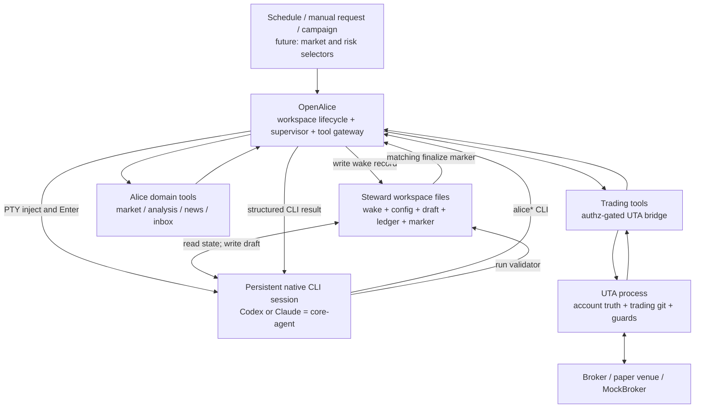
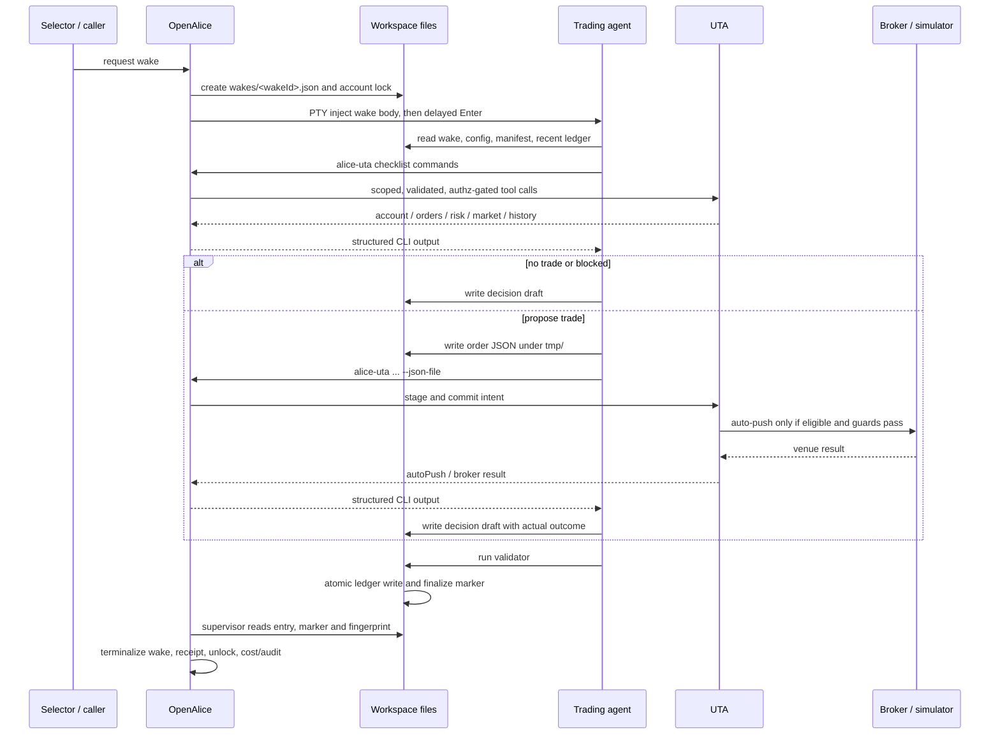

# Trading Agent 架构与信息流

> 状态：当前实现真源（`jieke/dev`，2026-07-11）。本文解释 trading-agent、
> OpenAlice 与 UTA 的责任边界，以及信息如何流入、动作如何流出、什么才算真实完成。
> 行为规范见 [steward-workspace-behavior-contract.zh.md](steward-workspace-behavior-contract.zh.md)，
> 市场测试分层见
> [trading-agent-runtime-and-market-testing.zh.md](trading-agent-runtime-and-market-testing.zh.md)。

## 1. 最重要的心智模型

Trading agent 不是 OpenAlice 内部一个“传入参数、返回结果”的函数。它是一个住在独立
workspace 中、运行于原生 Codex / Claude CLI 持久会话里的**常驻交易 steward**。

OpenAlice 不拥有模型推理循环。OpenAlice 负责创建和恢复会话、决定何时唤醒、提供工具、
施加权限、观察完成信号；core-agent 自己读取文件、调用 CLI、形成判断并写出决策草稿。

因此系统不是一条 RPC，而是三个相互配合的协议面：

| 协议面       | Agent 看到的形式                                            | 主要用途                                      | 主要失败模式                                         |
| ------------ | ----------------------------------------------------------- | --------------------------------------------- | ---------------------------------------------------- |
| 控制面       | PTY 中出现一段 `<STEWARD_WAKE>` 文本                        | 唤醒持久会话，告诉它本轮处理哪个 wake         | TUI 未就绪、回车被吞、会话假死、上下文溢出           |
| 工具面       | `alice` / `alice-workspace` / `traderhub` / `alice-uta` CLI | 查询市场与账户、提交交易意图、推送 Inbox      | 参数漂移、自由文本触发 shell 安全分类、返回语义丢失  |
| 状态与提交面 | `.alice/steward/` 下的 JSON / JSONL / marker 文件           | 保存 wake、历史、草稿、完成证明、锁和运行状态 | 半写、并发覆盖、错误 wakeId、历史被改、marker 不匹配 |

Claude Opus 4.8 提出的“steward 是 workspace 的居民，不是被调用的函数”是准确的；把边界
概括为“键盘 + 本地 HTTP”也抓住了主要摩擦。但从当前实现看，文件系统不是附属细节，而是
第三条正式协议面：一次 wake 的提交、完成和审计都由它承载。

## 2. 五个层次，各自负责什么



### 2.1 Core-agent / trading-agent

- **Core-agent** 是 Codex、Claude 等通用 agent 的原生模型循环、system prompt、工具使用和
  transcript。
- **Trading-agent** 是 core-agent 加上 steward 模板、行为 instruction、skills、wake
  协议、UTA checklist、权限和 ledger 契约后的产品角色。
- 模型负责“看到了什么、如何解释、建议做什么、为什么”；它不拥有账户真相，也不拥有最终
  执行权。

### 2.2 OpenAlice

OpenAlice 是运行与上下文控制平面：

- 创建、恢复、轮换和观察持久 PTY session。
- 写 wake record，并把窄 wake 消息注入会话。
- 给每个 workspace 注入身份、instruction、skills 和 CLI 环境变量。
- 根据 workspace 与账户计算有效授权，裁剪和包裹工具。
- 运行 supervisor，管理 account lock、deadline、stuck/timeout、成本、ledger receipt
  与 finalize barrier。
- 把 agent 的 Inbox 请求写入用户可见的 Inbox。

OpenAlice 不替 agent 做交易判断，也不把 terminal prose 当作完成证明。

### 2.3 UTA

UTA 是账户和交易域的权威边界：

- broker connection、账户、持仓、订单、成交和历史。
- trading-git 的 stage / commit / reject / push 状态。
- 风险状态、paper auto-push 资格与 deterministic policy guards。
- broker mutation 的执行结果与恢复状态。

Alice 中的 `src/tool/trading.ts` 是到 UTA SDK 的薄桥，不是第二套交易领域实现。

### 2.4 Broker / venue

Broker、paper venue 或 MockBroker 是执行事实的最终来源。Ledger 说“已执行”但 broker 没有
对应结果时，ledger 是错的；不能反过来用 ledger 覆盖 venue truth。

### 2.5 Supervisor

Supervisor 是 agent 外部的观察者和生命周期裁判。它负责判断 wake 是否按协议完成、是否
超时、是否发生 ledger integrity drift，但不判断“该不该买”。

## 3. 信息如何流入 trading agent

### 3.1 身份与行为规则

Workspace 创建时，launcher 把同一份 steward instruction 写成 `AGENTS.md` 和
`CLAUDE.md`，并复制 CLI skills。它们规定：

- 你的世界是 steward workspace，不是 OpenAlice 源码树。
- 每次 wake 先跑固定 UTA checklist。
- 不得调用 `push`，不得把 commit 当成成交。
- 自由文本参数必须先用 native Write/Edit 写进 JSON，再用 `--json-file` 调 CLI。
- 决策只能写 draft，由 validator 提交 ledger。

`.alice/steward/context-manifest.json` 是这些行为输入的**版本清单**：它记录模板版本、
wrapper prompt、instruction/skill 的路径与 SHA-256、schema 版本。它目前**不包含行情、指标、
新闻或账户快照**。市场事实来自 wake envelope、campaign 文件或实时工具查询。还要注意一处
当前漂移：manifest 生成器仍声明 `decisionLedger: 1`，而实际写路径已经强制 v2；所以现阶段
instruction/skill 的哈希可用于版本追踪，但 manifest 中的 ledger schema 数字不能单独作为
运行时真相。

### 3.2 持久会话记忆

同一个 native CLI session 会跨 wake 保留 transcript。OpenAlice 优先 resume 既有 session；
当 context 接近上限或会话不可恢复时再轮换。Transcript 能帮助连续理解，但不是权威状态：
账户与成交要重新查 UTA，过去决定要重新读 ledger。

### 3.3 Wake envelope

Selector 或人工请求先让 OpenAlice 写入：

```text
.alice/steward/wakes/<wakeId>.json
```

当前 schema 的核心字段是：

| 字段               | 含义                                                                                         |
| ------------------ | -------------------------------------------------------------------------------------------- |
| `reason`           | `scheduled_observe` / `market_event` / `risk_event` / `user_request` / `supervisor_recovery` |
| `accountId`        | 本轮绑定的账户                                                                               |
| `authzLevel`       | workspace 请求的授权上限                                                                     |
| `expectedDecision` | orchestrator 的评估标签，只用于审计，不是给 agent 的建议                                     |
| `marketContext`    | 本轮已整理的市场上下文；campaign 可在这里放匿名 bars 和唯一可交易合约                        |
| `riskContext`      | 本轮风险上下文                                                                               |
| `humanRequest`     | 可选的人类请求                                                                               |
| record metadata    | `wakeId`、deadline、sessionId、状态、注入与完成时间等                                        |

随后 Injector 分两次写 PTY：先写 `<STEWARD_WAKE>` 正文，等待 3000ms，再单独写 Enter。
这个延迟不是交易逻辑，而是对 native TUI 启动和 paste 识别行为的兼容。

Schema 已容纳 `market_event` 和 `risk_event`，但当前生产实现主要完成的是 schedule、手工
wake、campaign 与 supervisor recovery；自动化 market/risk selector 仍是待扩展控制面。

### 3.4 Workspace 持久文件

Agent 每轮还会主动读取：

- `.alice/steward/config.json`：账户指针、默认配置和成本预算。
- `.alice/steward/context-manifest.json`：本轮行为输入的版本与哈希。
- `.alice/steward/ledger/decisions.jsonl` 尾部：历史决策与未失效 thesis。
- campaign / workspace 额外提供的市场文件：例如 blind replay 的匿名历史 bars。

### 3.5 实时工具结果

固定 checklist 的账户、持仓、订单、风险、市场和历史由 agent 主动调用 `alice-uta` 获取。
更广的市场数据、分析、新闻和协作能力分别通过 `alice`、`traderhub`、`alice-workspace` 等
CLI 获取。稳定背景留在文件里，易变事实临近决策时重新查询。

## 4. CLI 请求实际走到哪里

Workspace 默认**不注入 MCP 配置**。Launcher 把四个 CLI shim 放进 `PATH`，并注入：

- `AQ_WS_ID`
- `OPENALICE_TOOL_URL`，或本机 Unix socket `OPENALICE_TOOL_SOCKET`
- interactive session 的 `AQ_SESSION_ID`，或 headless run 的 `AQ_RUN_ID`

因此端口 `47332` 只是兼容默认值，不是稳定架构边界。Dev/Electron 可以复用 loopback web
listener 的 `/cli`；Docker/public-web 可以使用独立 loopback gateway；本地还可以走 Unix
socket。

一次命令的真实路径是：

```text
agent shell
  -> alice-uta order place --json-file <path>
  -> shim reads JSON and POSTs {tool, args}
  -> /cli/<wsId>/uta/invoke
  -> server resolves authoritative workspace/session identity
  -> server builds authz-filtered scoped tool catalog
  -> strict Zod validation and coercion
  -> trading tool
  -> UTAAccountSDK over HTTP
  -> UTA domain
  -> broker / simulator
  -> structured result returns along the same path
```

所以这条链不是“任意 HTTP BFF 直接透传 UTA”。CLI gateway 会先决定该 workspace 能看见
哪些命令、参数是否合法、目标账户的有效权限是多少，再执行对应 tool。

Inbox 也是同一模式：agent 的主要表面是
`alice-workspace inbox push`，Alice 内部把它映射到 workspace-scoped `inbox_push` tool，并
从 URL、session/run header 绑定来源。Agent 不自行填写可伪造的 workspace identity。

## 5. 权限与执行边界

工具面把 trading tools 分为三类：

| 类别      | 例子                                                  | 规则                                     |
| --------- | ----------------------------------------------------- | ---------------------------------------- |
| Read-only | account、portfolio、orders、quote、risk、log、history | `read_only` 可见                         |
| Proposal  | place/modify/cancel、close、commit、reject            | 有效授权至少为 `paper`，并与账户类型兼容 |
| Removed   | `tradingPush`                                         | 不暴露给 workspace agent                 |

有效授权不是只信 wake 里的字符串，而是由 workspace authz 与 account
`maxAuthzLevel` 共同取保守结果。Paper/mock commit 的 auto-push 还必须满足：

- account type 确实是 paper/mock；
- effective authz 至少为 paper；
- mutation state 可执行，pending hash 没有变化；
- risk state 为 `NORMAL`；
- paper policy 通过，例如风险增加订单有合规 stop、不能给亏损仓加仓。

这意味着“agent 调用了下单命令”只表示它发起了意图，不表示成交。

## 6. 信息如何从 trading agent 流出

### 6.1 交易意图与执行结果

风险增加动作通常经历：

```text
order params JSON
  -> UTA stage
  -> UTA commit
  -> paper auto-push eligibility + guard preflight
  -> broker mutation
  -> autoPush result
```

`autoPush` 的四种 agent 语义是：

| 结果                                     | Agent 应记录的含义                           |
| ---------------------------------------- | -------------------------------------------- |
| `status: pushed`                         | `executed`；broker/simulator 已收到执行动作  |
| `status: skipped`, `paper_policy_denied` | `policy_denied`；没有执行，需记录 violations |
| `status: failed`                         | `failed`；执行链真实失败                     |
| 其他 skipped 或字段缺失                  | `awaiting_approval`；不能声称已成交          |

`pendingHash` 只表示仍在等待批准的 commit。已经 push 的 hash 应写到
`actions[].commitHash`，此时 `pendingHash` 必须为 `null`。

### 6.2 决策提交与 wake 完成

Agent 不直接编辑 ledger。当前提交协议是：

```text
native Write/Edit
  -> drafts/<wakeId>.json
  -> node .alice/steward/validate-ledger.mjs <wakeId>
  -> strict v2 schema + wake identity + prior integrity checks
  -> cross-process ledger lock
  -> temp file + fsync + atomic rename
  -> ledger/decisions.jsonl
  -> finalize/<wakeId>.json
  -> supervisor compares semantic fingerprint
  -> wake becomes done / blocked / error
```

Draft 写完不算完成，ledger 中出现一行也不一定算完成。对新 wake，只有 ledger entry 与
finalize marker 的 semantic fingerprint 匹配，supervisor 才允许 terminalize。

Supervisor 在第一次 terminal transition 时保存 ledger receipt，以后继续检查已完成条目
是否消失或发生语义修改。因为 wake、ledger、receipt 仍处于 agent 可写的同一 workspace
信任域，这套机制是 **corruption-evident**，不是 tamper-proof。真正不可由 agent 自述覆盖的
事实仍在 UTA 和 broker。

### 6.3 用户沟通与屏幕文本

- `alice-workspace inbox push`：给用户的正式异步沟通出口，可附 workspace 文档。
- PTY terminal prose：方便人观察和调试，但不是完成、交易或成交的权威证明。
- supervisor log、cost state、tool-call/audit refs：运行稳定性与成本证据。

## 7. 一次标准 wake 的完整时序



## 8. 什么是真相

发生冲突时，按以下顺序判断：

1. **Broker / venue result**：订单是否提交、成交、拒绝，最终以执行场所为准。
2. **UTA state、commit 与 mutation audit**：账户、pending、guard 和 broker carrier 的权威记录。
3. **Validated decision ledger**：agent 对本次 wake 做了什么、为什么、证据和成本是什么。
4. **Inbox 与 terminal prose**：解释和沟通，不覆盖前三层。

这四层回答的是不同问题。Ledger 是决策真相，不是账户真相；terminal prose 两者都不是。

## 9. 为什么这个系统会产生很多摩擦

这不是简单的“trading agent 与 OpenAlice 不兼容”，而是我们把一个面向人类编程工作的原生
CLI，包装成长期无人值守、可交易、可审计的 worker。每个原本由人在场吸收的小问题，都必须
变成明确协议：

| 阻抗失配                     | 具体表现                                                  | 结构性应对                                          |
| ---------------------------- | --------------------------------------------------------- | --------------------------------------------------- |
| 事件系统 vs 交互 TUI         | wake 靠 PTY 输入，Enter 可能被当作 paste                  | 分离正文与 Enter、supervisor liveness               |
| 结构化交易参数 vs shell      | thesis 中的引号、反引号、美元符号触发 Bash classifier     | native Write/Edit + `--json-file`                   |
| 多阶段执行 vs 一句“下单成功” | staged、committed、pushed、filled 被混为一谈              | 暴露 `autoPush`，typed action outcome，venue 对账   |
| LLM 宽松输出 vs 严格审计     | 字符串数字、漏字段、复制旧 wakeId                         | strict validator、有限 coercion、identity binding   |
| 持久 session vs 单轮任务     | 上下文污染、超时、恢复后状态不一致                        | transcript rotation、recovery wake、外部 supervisor |
| 文件状态 vs 数据库事务       | 半写、并发 writer、历史被改                               | 单 writer、lock、fsync+rename、marker、receipt      |
| 双实现协议                   | TS supervisor 与生成到 workspace 的 JS validator 可能漂移 | parity/golden tests 与 runtime refresh              |

这些 issue 多数在加强 agent 与基础设施之间的协议可靠性，而不是反复修同一个交易策略。
代价确实来自“模拟一个人坐在终端前”；收益则是 OpenAlice 不需要为每种 agent 能力重写模型
循环，workspace 可以隔离、迁移、并行，并继续使用原生 agent 的完整能力。

## 10. 当前仍不完整的地方

- 自动 market/risk selector 尚未成为完整生产输入面；目前主要靠 schedule、manual wake、
  campaign 和 recovery。
- `context-manifest.json` 只做行为版本追踪，还不是统一的 market/account/risk snapshot manifest。
- Manifest 生成器的 `decisionLedger` 版本仍停在 1，与当前 strict v2 writer 不一致；这是
  协议升级后留下的版本清单漂移。
- 当前 performance harness 的核心信息仍以单账户、有限 OHLCV、持仓和风险为主；新闻、宏观、
  基本面、多资产机会集和真实交易摩擦尚未系统进入每次 wake。
- Workspace ledger integrity 只能检测意外漂移，不能抵抗同一信任域内的协调篡改。更强保证
  需要把 receipt/签名或最终审计移出 agent 可写目录。
- PTY/TUI 控制面仍受不同 native CLI 版本和启动时序影响；它不是像 RPC 一样天然确定。

因此当前系统已经是一个较完整的**持久交易 worker runtime**，但还不是一个信息面完整、
事件驱动成熟、可直接放开实盘权限的 autonomous portfolio manager。

## 11. Plan v2 方向

### 11.1 必须分开两个判断

Persistent workspace、native agent CLI、独立 UTA、无 `push` 权限、外部 supervisor、结构化
draft 和原子 ledger writer，是一套已经得到较强 isolated-load 验证的**agent runtime**。

但这不等于“让通用 coding agent 自由决定仓位并自动交易”已经得到验证。Canonical v8 中，
runtime 通过 60/60 wakes，而 behavior verdict 没有改善，且多个约 70% exposure intent 是被
测试账户 guard 拒绝后才没有执行。前者是工程成功，后者是产品与风险契约尚未收敛。

### 11.2 新的职责边界

Steward 首先是研究、组合判断和交易提案者。它应输出结构化 Decision Intent：方向、信心、
目标暴露范围、最大可接受损失、失效条件、期限与证据快照。

UTA 或未来独立的确定性 sizing 层负责：

- 读取账户 mandatory Risk Envelope；
- 根据 max position、daily loss、drawdown、symbol/asset scope 和剩余预算约束实际数量；
- 在 envelope 缺失时 fail closed；
- 在任何 broker mutation 前重查 authz、risk state、pending identity 和 revoke/admission；
- 返回 typed proposal、拒绝原因或实际 venue outcome。

Prompt 可以影响判断纪律，不能充当仓位上限。“Agent 想买 70%”不是执行许可。

### 11.3 保留的基础架构

- 不退回 OpenAlice 内部自建模型循环。
- 不让 agent 绕过 UTA 直连 broker，也不把 broker credential 或 `push` 交给 agent。
- 保留 native Write/Edit + `--json-file`、typed `autoPush` outcome 和 validator 单 writer。
- 保留 broker/UTA/ledger/prose 的真相层级。
- 保留 persistent session，但把它定位在日/周级研究与协作；低延迟 trigger、撤权、risk action
  和 broker control 属于确定性控制面。

### 11.4 信息输入要成为正式契约

当前 `context-manifest.json` 记录 instruction/skill/schema 的版本，不是 agent 决策时的信息集。
下一版设计应把 behavior bundle 与 as-of Information Snapshot 分开：market、portfolio、risk、
events、history 各自带 identity、timestamp 和 freshness。这样才能回答“agent 当时知道什么”，
也才能重放和评价 Decision Intent。

### 11.5 评测必须拆成三层

| 层                   | 证明什么                                         | 明确不证明什么  |
| -------------------- | ------------------------------------------------ | --------------- |
| Protocol reliability | wake、CLI、ledger、finalize、lock、recovery 正常 | agent 判断正确  |
| Decision quality     | 同一信息集上的 intent 合理、可解释、风险匹配     | broker 执行可靠 |
| Execution fidelity   | sizing、订单生命周期、费用、滑点、venue 对账正确 | 策略有 alpha    |

Guard 拒绝是 containment evidence，不是 decision pass。共享 UTA 污染、cleanup/restart 竞争或
account 不隔离时，该 cell 是 invalid evidence，不能拿来调 prompt。

### 11.6 Runtime freeze 与重开条件

当前 control/tool/state protocol 进入 freeze。只有出现违反既有不变量的新证据，才重开 runtime
hardening；不能因为 issue 数量仍多就继续修补。未来重新进入 autonomous execution 前，至少要
重新审查：mandatory Risk Envelope、deterministic sizing、revoke/admission barrier、ledger
commit point 的信任域，以及 proposal/broker outcome 的幂等对账。

### 11.7 当前不做

- 不继续 participation prompt tuning，不激活 issue #126 candidate。
- 不打开 holdout，不运行真实 paper 或 live。
- 不把更多账户/成交真相塞进 workspace ledger。
- 不用更多 prompt 段落掩盖 adapter、schema、transaction、risk 或 supervisor 的确定性问题。
- 不先实现多 agent/bot 拓扑；先把单体 steward 的 Decision Intent 与风险包络契约做清楚。

活动阶段、授权和停止条件以 [steward-plan.zh.md](steward-plan.zh.md) 为准。

## 12. 代码导航

| 问题                                | 主要实现                                                   |
| ----------------------------------- | ---------------------------------------------------------- |
| Wake 文本和 3000ms Enter            | `src/workspaces/steward/injector.ts`                       |
| Wake / ledger / marker schema       | `src/workspaces/steward/types.ts`                          |
| Workspace 行为 instruction          | `src/workspaces/templates/steward/files/instruction.md`    |
| Draft validator 与 runtime refresh  | `src/workspaces/templates/steward/bootstrap.mjs`           |
| Supervisor reconciliation           | `src/workspaces/steward/supervisor.ts`                     |
| Session 创建、恢复、轮换和定时 wake | `src/workspaces/service.ts`                                |
| CLI shim                            | `src/workspaces/cli/bin/alice-uta`（四个 binary 内容相同） |
| CLI gateway                         | `src/server/cli.ts`                                        |
| Workspace authz/tool catalog        | `src/core/workspace-tool-center.ts`                        |
| Alice 到 UTA 的 trading bridge      | `src/tool/trading.ts`、`src/services/uta-client/`          |
| Paper auto-push 与 guards           | `services/uta/src/domain/trading/paper-auto-push.ts`       |
| Alice / UTA wire shape              | `packages/uta-protocol/`                                   |
