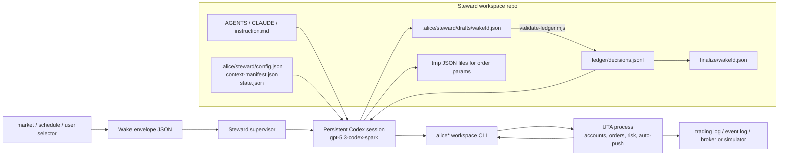
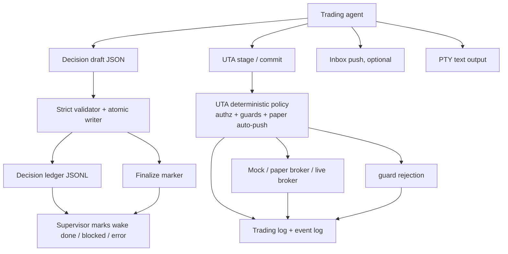

# Trading Agent Runtime 与市场测试设计

> 状态：运行与测试真源（2026-07-10）。本文件解释 trading-agent 在 OpenAlice
> workspace 里的结构、信息流、输出流，以及下一阶段为了提高 performance 应采用的
> 真实市场测试环境。它不改变 prompt、wake schema 或 UTA 行为，只把当前系统和实验方向
> 讲清楚。2026-07-10 的 v7 Spark baseline 见 §8 和
> [appendix/steward-v7-spark-baseline-20260710.md](appendix/steward-v7-spark-baseline-20260710.md)。
> 架构与信息流的当前实现真源已拆分到
> [trading-agent-architecture.zh.md](trading-agent-architecture.zh.md)；本文后半部分继续作为
> 市场测试分层与 baseline 真源。

## 1. 一句话

OpenAlice 里的 trading-agent 不是一个直接跑在源码仓库上的 coding agent。它是一个
长期存在的 **persistent steward workspace**：Codex 作为 core-agent，在 steward
模板、workspace 文件、wake envelope、UTA 工具和 supervisor 的约束下工作。它看到的是
一个小型交易台，而不是 OpenAlice 的实现细节。



## 2. 输入怎么流入 Agent

trading-agent 的输入分为五类。关键原则是：稳定背景写入 workspace 文件；每次醒来只注入
窄的 wake envelope；实时事实通过工具查询；不把 OpenAlice 源码、端口和内部 HTTP 路由
暴露成它的日常世界。

| 输入类别 | 形式 | 谁写入 | Agent 怎么使用 | 例子 |
| --- | --- | --- | --- | --- |
| 身份和行为规则 | workspace instruction / `AGENTS.md` / skills | workspace template | 定义它是 steward，不是 code-agent；定义 UTA checklist、ledger 契约、风控纪律 | `src/workspaces/templates/steward/files/instruction.md` |
| 持久交易状态 | `.alice/steward/*.json` 和 ledger | OpenAlice + agent | 读取账户绑定、行为输入版本、历史决策、成本状态 | `config.json`、`context-manifest.json`、`ledger/decisions.jsonl` |
| 本次任务边界 | wake envelope JSON | selector / supervisor | 知道本轮为什么醒来、看哪个账户、deadline 是什么、有哪些市场上下文 | `wakeId`、`accountId`、`marketContext.bars` |
| 实时账户和市场事实 | `alice*` CLI 工具结果 | UTA / market-data layer | 跑 checklist，查账户、持仓、订单、risk、quote、bar source | account info、positions、riskState、market clock |
| Core-agent 记忆 | Codex session transcript | Codex CLI | 保留连续 session 上下文，但完成边界仍以 ledger 为准 | 上一轮 wake 的对话和工具使用痕迹 |

在当前 campaign harness 里，marketContext 是真实历史 OHLCV 的匿名重放：真实 symbol 和真实
日期保留在 cell 的 `_provenance` 里给 orchestrator 审计，但不交给 agent。agent 只看到
rebased 的 `ASSET-A` / `ASSET-B`、fictional day index 和截至当时可见的 bars。

注意：`context-manifest.json` 本身不承载市场数据。它记录模板、wrapper prompt、
instruction、skills 和 schema 的版本/哈希；行情来自 wake、campaign 文件或实时 CLI 查询。

## 3. 输出怎么流出到 OpenAlice

Agent 的输出不是随口说一句“我买了”。它有几条不同的出口，每条出口有不同的权威边界。



| 输出类别 | 形式 | 权威含义 |
| --- | --- | --- |
| 本轮决策记录 | `.alice/steward/ledger/decisions.jsonl` 一行 JSON | validator 原子提交的决策；单独出现还不足以完成新 wake |
| 本轮完成标记 | `.alice/steward/finalize/<wakeId>.json` | marker fingerprint 与 ledger entry 匹配后，supervisor 才允许 wake 终态化 |
| 交易意图 | UTA trading git staged operation + commit hash | 表示 agent 提出了可审计交易计划；不等于已经执行 |
| paper/mock 执行 | UTA `autoPush.status: pushed` | 表示 deterministic paper auto-push 已执行到 broker/simulator |
| guard 拒绝 | UTA `autoPush.status: skipped` + `paper_policy_denied` | 表示交易没有执行，agent 必须纠正或诚实降级 |
| 用户沟通 | Inbox / audit / terminal text | 辅助解释，不是交易权威 |
| 成本记录 | steward state + transcript token usage + report | 用于 net-after-cost PnL，不应事后补猜 |

因此，performance 调参时我们不能只看 agent 的自然语言结论；必须同时看 ledger、UTA commit、
auto-push 结果、最终 equity curve 和 transcript cost。

## 4. Workspace 内的一次 Wake 怎么跑

一次标准交易 wake 的流程如下：

```mermaid
sequenceDiagram
  participant S as Supervisor
  participant A as Codex steward
  participant W as Workspace files
  participant U as UTA
  participant B as Broker / Simulator

  S->>W: write wakes/<wakeId>.json
  S->>A: inject wake message into persistent session
  A->>W: read config, manifest, recent ledger
  A->>U: account / positions / orders / risk / market / history checklist
  U-->>A: structured tool results
  A->>A: evaluate trend, momentum, volatility, levels, volume
  alt no trade
    A->>W: write decision draft
  else propose trade
    A->>W: write tmp order JSON
    A->>U: order place --json-file + commit
    U->>B: auto-push if paper/mock and guards pass
    B-->>U: fill / rejection / order state
    U-->>A: autoPush result
    A->>W: write draft with actual action and pendingHash
  else blocked
    A->>W: write blocked decision draft
  end
  A->>W: run validate-ledger.mjs
  W->>W: atomic ledger commit + finalize marker
  S->>W: verify ledger and marker fingerprint
  S->>S: mark wake done / blocked / timeout; record cost
```

行为上，当前 steward prompt 的核心纪律是：

- 清晰、证据充分的上升趋势应参与；长期空仓跑输牛市也是失败。
- 证据不清、走弱、下行时默认 `no_trade`；震荡噪音不是“试一笔”的理由。
- 风险增加的订单必须有 stop；stop 风险约束在单笔约 8% 内。
- 不能给亏损仓补仓。
- `expectedDecision` 是 orchestrator 记账字段，不是 agent 的答案提示。
- `committed` 不等于成交；必须检查 `autoPush`。

## 5. 当前市场与数据现实

当前本地 dev 配置里只有 `mock-simulator` paper accounts。这意味着：**执行环境是虚拟的**，
不会连接真实交易所或券商下单。但 campaign cell 的行情并不一定是虚构的：它们可以由真实
历史市场数据生成，然后匿名、rebased、按时间逐步重放进 MockBroker。

此前 checked-in 的 4 个 legacy cells 确实全部来自 crypto；performance 阶段已经把
cell library 扩成 `legacy` / `dev` / `holdout` 三组，详见
`tools/campaigns/cells/README.md` 和 `tools/campaigns/cells/manifest.json`。
legacy 组仍保留原来的 crypto 基线：

| Cell | 真实来源（只给 orchestrator 审计，不给 agent） | 区间 | 用途 |
| --- | --- | --- | --- |
| `bull-cx.json` | BTCUSDT | 2024-02-05 至 2024-03-05 | 牛市参与 |
| `bear-eth.json` | ETHUSDT | 2026-01-26 至 2026-02-24 | 熊市避险 |
| `bear-sol.json` | SOLUSDT | 2025-01-26 至 2025-02-24 | 熊市避险 |
| `chop-cx.json` | BTCUSDT | 2024-11-27 至 2024-12-26 | 震荡不过度参与 |

所以准确说：

- 我们现在拿到的是 **真实历史 crypto OHLCV 的匿名回放**，不是纯随机假数据。
- 但它不是完整真实金融环境：没有真实 symbol 语义、新闻、财报、宏观、市场小时、
  真实费用、滑点、partial fills、borrow/funding、跨资产机会集。
- OpenAlice 代码已支持 equity cell 生成，`fetch-and-classify.mjs` 支持
  `--asset equity`，但当前 cell library 太窄，主要验证的是高波动 crypto tape reading。

这解释了“看起来只有虚拟货币”的问题：不是架构只能测虚拟货币，而是早期实验集只放了
crypto cells，而且使用 mock-simulator 执行。新的 dev/holdout cells 已覆盖 US single
name、US ETF、HK/TW equity、FX、commodity proxy；执行仍是 mock-simulator，行情来源仍是
真实历史 OHLCV 的匿名回放。

## 6. 下一阶段应如何营造更真实的测试环境

为了提高 trading-agent performance，下一阶段不要直接跳 live，也不要继续只用 4 个 crypto
cells。应该分层扩展，让“真实市场信息”和“安全可控执行”同时存在。

### L0：当前 blind single-asset replay

目的：最小可复现地测 tape-reading、风控、ledger、auto-push、成本。

- 数据：真实历史 OHLCV，匿名、rebased、无真实日期。
- 执行：MockBroker。
- 优点：反作弊、便宜、稳定、可并行。
- 缺口：不测试真实 symbol 研究能力，也不测试事件/新闻/基本面。

### L1：多资产 historical replay

目的：让 agent 面对真实组合选择，而不是只有一个 `ASSET-A`。

- 数据：同一历史窗口的多资产 bars，例如 SPY/QQQ/TLT/GLD/XLE，或 BTC/ETH/SOL。
- 执行：MockBroker，多合约同账户。
- 增加内容：现金分配、相对强弱、避险资产、换仓、组合回撤。
- 验收重点：不是“看到涨的就买”，而是能在机会集中选择更好的风险回报。

### L2：事件化 replay

目的：接近真实交易环境中的信息不完整和事件冲击。

- 数据：OHLCV + earnings calendar / macro board / news archive / sector board 的 as-of 快照。
- 执行：仍用 MockBroker，避免真实资金。
- 增加内容：财报日前降风险、宏观冲击、趋势与事件冲突时的判断。
- 验收重点：agent 能解释信息新鲜度，不用未来信息，不把 stale data 当 current price。

### L3：真实 paper broker

目的：测试真实 broker/tool friction。

- 数据：broker/keyless realtime 或 delayed bars，按账户实际可得性标注 freshness。
- 执行：Alpaca paper、Binance/Bybit/OKX demo、IBKR paper、Longbridge paper 等。
- 增加内容：market hours、订单生命周期、真实 API 错误、成交状态同步、费用/滑点近似。
- 验收重点：trading-agent 不仅“想得对”，还要在真实 broker 语义下稳定执行。

### L4：小额实盘候选

目的：只有当 L0-L3 都稳定后，才考虑小额实盘。

- 执行必须仍由 UTA deterministic policy 和人类边界控制。
- agent 不拿 push 权限。
- 必须有金额上限、日损上限、kill switch、审计和回滚。

## 7. 建议的验收市场矩阵

下一轮 performance tuning 至少应覆盖这些市场，而不是只覆盖 crypto：

| 市场 | 样例 | 为什么需要 |
| --- | --- | --- |
| Crypto major | BTC, ETH, SOL | 24/7、高波动、趋势明显，适合快速暴露参与/止损问题 |
| US index / ETF | SPY, QQQ, IWM, TLT, GLD, XLE | 更接近传统 portfolio allocation，可测风险资产/避险资产切换 |
| US single names | NVDA, TSLA, AMD, AAPL | 趋势强但事件风险高，可测财报/动量/回撤纪律 |
| HK / CN / TW equities | 0700.HK, 9988.HK, 600519.SS, 2330.TW | 检查全球市场 symbol、时区、数据源差异 |
| FX / commodities data | EURUSD=X, USDJPY=X, gold, crude_oil | 测宏观 regime 和非股票风险表达；交易执行可先只做 data/research |

开发集和验收集要分开。开发集用于 prompt/行为调参；验收集必须 holdout，且只在定版后跑，
否则我们会把 agent 调成“会背这几个窗口”的系统。

## 8. 2026-07-10 v7 Spark baseline

在 `jieke/dev@e32efb84` 上，明确指定 `gpt-5.3-codex-spark` 跑完 legacy + dev
共 10 个 cell、每格 6 周：60/60 wake 完成，正式 isolated-stack 结果中没有
timeout、stuck、账户锁泄漏、默认 AAPL 污染或 cell-end 三方对账失败。raw verdict
为 7/10；排除两个在当前 guard 下无法达到 +25% 的 observation-only bull cell 后，
为 7/8 gateable pass。NVDA +17.7% / maxDD 0% 是唯一 freeze-blocking behavior
failure，所以 holdout 仍封存。

这轮同时证明「isolated stack 能跑」不等于「shared stack 已无摩擦」。六个 workspace
同时 bootstrap 的两次测试都在 week 1 被 Codex trust-config 并发写竞争阻断：共享
配置丢失 trust block/变成畸形 TOML，六个 session 全部 `stuck`。这是 launcher
基础设施缺陷 #124；修复并重跑前，shared-stack independence 不能宣称通过。

本轮还暴露了 ledger 语义需要收紧：成功 auto-push 后 ledger `pendingHash` 与终态
UTA 的「无 pending approval」含义不一致，`actions` 存在多种 shape，重复 wakeId
entry 的 validator 行为未定义。这些字段在澄清前只能作为软审计信息，不能作为新的
UTA 权威或 performance gate。
它们跟踪于 #125；同轮观察到的一次 config mutation 两次 UTA restart 的放大问题
跟踪于 #127。

## 9. 这一阶段的建议结论

performance 阶段的第一目标不是让 agent 在一个 crypto 牛市 cell 上赚最多，而是让它在
丰富、真实、可复现的环境里形成稳定的 regime-aware 行为：

1. 扩大 cell library：crypto + US equity/ETF + HK/CN/TW equity，bull/bear/chop 各多例。
2. 先跑 L0/L1 blind replay，修 under-participation 和 over-participation 的行为平衡。
3. 再加入 L2 事件/基本面/宏观 as-of context，测试更接近真实研究流程。
4. 最后用 L3 paper broker 验证真实交易基础设施 friction。
5. 每轮报告必须同时列 gross PnL、net-after-cost PnL、maxDD、trade count、guard rejection、
   ledger honesty、wake stability 和 token/cost。
